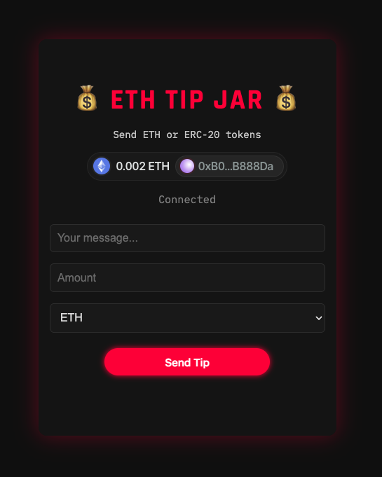
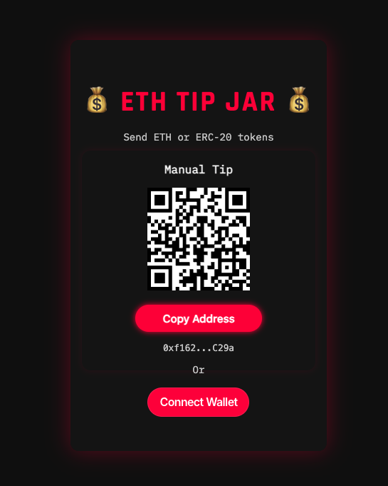

# ETH Tip Jar

A sleek decentralized tip jar dApp built with **Solidity, React, and Web3Modal**. Users can connect their MetaMask wallet and send **ETH or any supported ERC-20 token** along with a message. Styled with a bold, cyberpunk-inspired UI and designed for both desktop and mobile users.

**Currently deployed to Ethereum Mainnet** with a separate branch for Sepolia testnet.

---

## Live Demo

[View Live on Netlify](https://ethtipjar.netlify.app/)

---

## Deployments

| Network         | Address | Details |
|-----------------|---------|---------|
| **Mainnet**     | [0xf1622c…6C29a](https://etherscan.io/address/0xf1622c71C97b449FcDF683Be2Ca6bB120106C29a) | Verified on Etherscan |
| **Sepolia Testnet** | [0xE6788…ca35c](https://sepolia.etherscan.io/address/0xE6788218F75AF067271601B03a9040B7a18cA35c) | Verified on Etherscan |

---

## Tech Stack

- Smart Contract: Solidity (^0.8.28)
- Frontend: React (Vite) + Wagmi + viem
- Wallet Integration: Web3Modal v3 (WalletConnect)
- QR Code Fallback: Manual tip via qrcode.react
- Styling: Custom CSS with terminal/cyberpunk aesthetics
- Testing/Deployment: Foundry (forge)
- Hosting: Netlify

---

## Features

- Connect MetaMask (desktop or mobile)
- Send tips in ETH or supported ERC-20 tokens
- Add a message with each tip
- Token approval and allowance flow for ERC-20
- Supported tokens (Mainnet): ETH, LINK, USDC, WETH, UNI, SHIB, MATIC, DAI, AAVE
  - Note: USDT removed for launch due to high gas / approval quirks
- Randomized success feedback per tip
- Fully responsive UI (mobile and desktop)
- WalletConnect QR code and mobile browser support
- Verified smart contract (Mainnet + Sepolia)

---

## Project Structure

    ETH-TipJar/
    ├── broadcast/
    ├── cache/
    ├── contracts/
    │   └── TipJar.sol                 # Solidity contract
    ├── frontend/
    │   ├── dist/                      # Production build output
    │   ├── public/                    # Static assets
    │   ├── src/
    │   │   ├── assets/                # Images, icons, etc.
    │   │   ├── lib/
    │   │   │   ├── tipJarAbi.js       # Contract ABI
    │   │   │   └── tokenList.js       # Token metadata (mainnet addresses)
    │   │   ├── App.jsx                # Main React component
    │   │   ├── main.jsx               # App entry
    │   │   └── index.css              # Global styles
    │   ├── index.html                 # Entry point
    │   ├── vite.config.js             # Vite config
    │   └── package.json               # Frontend dependencies
    ├── lib/
    ├── out/
    ├── script/
    │   └── Deploy.s.sol               # Foundry deploy script
    ├── test/
    │   └── TipJar.t.sol               # Contract tests
    ├── .env                           # Environment variables (gitignored)
    ├── foundry.toml                   # Foundry config
    ├── README.md                      # This file
    └── remappings.txt

---

## Smart Contract Deployment (Mainnet)

To deploy and verify the contract using Foundry:

1) Load environment variables

    export $(grep -v '^#' .env | xargs)

2) Deploy and verify

    forge create \
      ./contracts/TipJar.sol:TipJar \
      --rpc-url $MAINNET_RPC_URL \
      --private-key $METAMASK_PRIVATE_KEY \
      --etherscan-api-key $ETHERSCAN_API_KEY \
      --verify \
      --broadcast

(For Sepolia, switch --rpc-url to $SEPOLIA_RPC_URL.)

---

## Local Frontend Development

Run the frontend locally with Vite:

    cd frontend
    npm install
    npm run dev

Then open:

    http://localhost:5173

---

## Deploying the Frontend

You can deploy using:
- Netlify (recommended for HTTPS and mobile compatibility)
- Vercel
- GitHub Pages

Netlify is ideal for wallet connections and QR functionality out of the box. When Netlify is configured to watch the `main` branch, pushing to `main` will auto-deploy the production (mainnet) build.

---

## Environment & Security Notes

- It is safe to expose your Web3Modal projectId in the frontend.
- Never commit your private key or .env file to version control.

Example .env file (not included in repo):

    MAINNET_RPC_URL=https://mainnet.infura.io/v3/your-key
    SEPOLIA_RPC_URL=https://sepolia.infura.io/v3/your-key
    METAMASK_PRIVATE_KEY=0xabc123...
    ETHERSCAN_API_KEY=your-etherscan-key

---

## Smart Contract Functions

| Function | Description |
|----------|-------------|
| `receive()` | Accepts plain ETH tips |
| `tip(string message)` | Sends ETH tip with message |
| `tipToken(address token, uint256 amount, string message)` | Sends ERC-20 tip with message |

---

## UI Logic Overview

- Uses Wagmi to detect connection state
- Shows QR code + copy address fallback when not connected
- Once connected, shows tip form (message, amount, token)
- Automatically handles token approval and allowance (ERC-20)
- Shows success or error status below the Send Tip button

---

## Completed Milestones

- [x] Smart contract deployed and verified (Mainnet + Sepolia)
- [x] ETH and ERC-20 token support
- [x] WalletConnect v2 QR support
- [x] Fully responsive frontend (mobile and desktop)
- [x] Token approval and allowance flow
- [x] Web3Modal v3 integration
- [x] Cyberpunk UI completed
- [x] Mobile + Coinbase Wallet tested
- [x] Mainnet addresses wired in tokenList.js

---

## Roadmap

- [ ] Add recent tip history (UI or backend)
- [ ] ENS address resolution (optional)
- [ ] Add stats view for total tips per token
- [ ] Light/dark mode toggle

---

## Screenshots

### Connected Wallet View

### Fallback / QR Code View

---

## License

MIT — free to fork, remix, and build upon.

---

## Credits

Built by [@Adam Flick](https://github.com/awflick) as part of a Web3 developer journey.  
Inspired by retro terminal interfaces, cyberpunk design, and Ethereum tipping culture.
